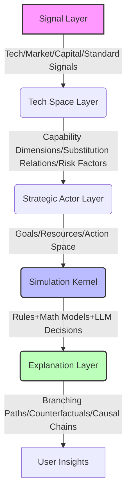

# Omen

**The Strategic Reasoning Engine.**

[](https://github.com/StrategyLogic/omen/actions/workflows/pylint.yml)
[](https://github.com/StrategyLogic/omen/actions/workflows/python-package.yml)

> **Simulate the Signs. Reveal the Chaos.**

[**Omen**](https://github.com/StrategyLogic/omen) (Chinese: 爻) is an open-source engine built for strategic reasoning in technological evolution. Leveraging **multi-agent game theory**, **capability space modeling**, and **counterfactual analysis**, it calculates how technological evolution reconstructs market landscapes.

[中文版](README.zh.md) | [Official Repo](https://github.com/StrategyLogic/omen) | [Concepts](docs/concepts.md) | [Quick Start](docs/quick-start.md) |  [Case Templates](docs/case-template.md) | [Roadmap](docs/roadmap.md)

## 💡 Why Omen?

Technological competition has never been linear. Real-world technological evolution is a complex system driven by multiple forces:
*   **Drivers**: Capability enhancement, cost curves, migration friction, organizational inertia, capital flow, ecosystem lock-in, standard promotion, developer behavior.
*   **Impacts**: Markets often do not change smoothly; instead, they undergo **accelerated substitution**, **structural reorganization**, or fall into a stalemate of **long-term coexistence** near certain thresholds.

Omen attempts to upgrade this process from *opinion discussion* to **conditional reasoning**:
1.  Map technological competition into a **Capability Space**
2.  Instantiate market entities as **Strategic Actors**
3.  Quantify external shocks as **Injectable Events**
4.  Present results as **Multi-path Evolution** and **Counterfactual Explanations**

### What Omen Does

Unlike traditional predictive models, Omen does not promise to *predict a certain future*. Instead, it generates **interpretable, replayable, and comparable future branching paths**. Its core responsibility is to reveal faint omens, critical branching points, and evolutionary trajectories within complex systems, empowering founders, product strategists, technology leaders, and investment analysts to understand:

*   🔄 **Substitution Logic**: Which technology will replace another under what critical conditions?
*   🛡️ **Capability Evolution**: Which core capabilities will be enhanced first, and which will coexist long-term?
*   🏆 **Strategy Wins**: Which strategy combinations are more likely to win the market, capital, and developer ecosystem?
*   ⏳ **Time Windows**: When is the optimal timing for in-house development, alliances, M&A, or contraction?

## 📜 Philosophy & Design Principles

> 💡 **Core Mantra**: *The machine simulates the "Situation"; the human decides the "Destiny".*

Just as **Yao** in the *I Ching* represents change and interaction, Omen is designed only to present the evolution of the **Situation (Xiang)**. Interpreting the deeper meaning behind the situation and making decisions is the exclusive privilege of human wisdom.

Accordingly, Omen is architected as a **human-decision-first** AI simulator, with a clear division of labor between machine simulation and human sovereignty:

#### 🤖 The Machine’s Domain (Simulation & Causality)
*   **Role**: To compute complexity, map multi-path evolutions, and reveal conditional causal chains.
*   **Output**: Interpretable scenarios, probability distributions, and "What-if" branching maps.
*   **Constraint**: It strictly avoids deterministic fate pronouncements or claims of "guaranteed accuracy".

#### 🧠 The Human’s Domain (Interpretation & Sovereignty)
*   **Role**: To interpret the "Situation" (Xiang), apply ethical judgment, and make the final strategic call.
*   **Privilege**: Deciding *which* path to take based on values, risk appetite, and vision remains the exclusive privilege of human leaders.
*   **Synergy**: Omen expands the horizon of visible possibilities; humans provide the compass for navigation.

📜 See [Omen Project Protocol](PROTOCOL.md) to get detailed guidelines.

## ⚙️ Core Features

| Feature Module | Description |
| :--- | :--- |
| 🧬 **Technology Capability Modeling** | Deconstructs complex tech stacks into quantifiable, comparable capability dimensions (e.g., latency, throughput, ease of use, ecosystem richness). |
| 🤖 **Strategic Agent Simulation** | Defines different types of market participants (startups, giants, open-source communities, regulators), endowing them with goals, resources, and constraints. |
| 📈 **Market Evolution Reasoning** | Simulates dynamic changes in adoption rates, market share, cost structures, cash flow, and ecosystems. |
| ⚡ **Critical Point Identification** | Automatically discovers key thresholds for "when substitution occurs" and "why it happens at this moment." |
| 🔮 **Counterfactual Analysis** | Answers "What would have happened if event X had not occurred, or if strategy Y had been adopted?" |
| 📖 **Result Explanation Engine** | Outputs key turning points, causal chain deductions, and strategic implications, rejecting black-box conclusions. |

### 📊 Typical Outputs

A complete reasoning session typically answers the following questions:
*   **Substitution?** Will the new technology completely replace the old one, or form a complement?
*   **Time Window?** When is the specific time window for substitution or turning points?
*   **Key Drivers?** Which variables (e.g., cost reduction speed, API compatibility) are the decisive factors?
*   **Winners and Losers?** Which entities suffer first, and which benefit unexpectedly?
*   **Strategy Effectiveness?** Under what circumstances is an "open ecosystem" superior to "vertical integration"?
*   **Endgame Form?** Does it move towards monopoly, oligarchic balance, or fragmented coexistence?

## 🛠️ How It Works

Omen adopts a layered architecture to ensure the transparency and intervenability of reasoning:



*   **Signal Layer**: Accesses multi-dimensional macro and micro signals.
*   **Tech Space Layer**: Transforms signals into structured technical objects and relationship graphs.
*   **Strategic Actor Layer**: Defines clear Action Spaces for various entities, rather than free-form chatting.
*   **Simulation Kernel**: Combines hard constraint rules, economic/diffusion models, and LLM decision logic to advance multi-round evolution.
*   **Explanation Layer**: Extracts key branching points and generates human-readable reasoning reports.

## 🎬 Show Cases

We have built-in classic reasoning:
*   [🗺️ Ontology Games: Database vs AI Memory](cases/ontology.md)
*   [⚔️ Vector Database vs AI Memory](cases/vector-memory.md)   

More scenarios are under development (contributions welcome):
*   `Agent Infrastructure` vs `Workflow Platforms`
*   `Vertical AI` vs `General AI Stack`
*   `Open Source Models` vs `Closed Commercial APIs`
*   `Data Governance` vs `AI-Native Knowledge Systems`

## 🚀 Quick Start

### Installation

Environment requirements: Python 3.12+ with `pip` package manager.

```bash
git clone https://github.com/StrategyLogic/omen.git
cd omen
pip install --upgrade pip setuptools wheel
pip install -e .
```

### Run Example
```bash
# run simulate
omen simulate --scenario data/scenarios/ontology.json

# run simulate with stable seed (reproducible)
omen simulate --scenario data/scenarios/ontology.json --seed 42

# explain results
omen explain --input output/result.json

# compare scenarios with generic overrides
omen compare --scenario data/scenarios/ontology.json --overrides '{"user_overlap_threshold": 0.9}'

# compare with business parameter entrypoint (budget shock)
omen compare --scenario data/scenarios/ontology.json --budget-actor ai-memory --budget-delta 200

# keep historical outputs
omen compare --scenario data/scenarios/ontology.json --budget-actor ai-memory --budget-delta 200 --incremental
```

### View Results

**Local File Protection**: Output files are written to the root-level `output/` directory, which is excluded in `.gitignore` to avoid being tracked or accidentally uploaded, protecting your data from leakage.

Example: `output/result.json`, `output/explanation.json`, `output/comparison.json`

By default, each run of the simulation will overwrite the previous results; you can add the `--incremental` to generate new files with a timestamp suffix, which applies to all `omen CLI` commands.

```bash
# This will not overwrite the previous output (output file will automatically have a timestamp suffix)
omen simulate --scenario data/scenarios/ontology.json --incremental
```

By default, `simulate` use random seed to generate non-deterministic results; you can set a fixed `--seed` for reproducibility, it is recommended to compare different scenarios with the same seed to see the pure impact of parameter changes without random noise.

```bash
# Run simulate with a fixed seed (results will be reproducible)
omen compare --scenario data/scenarios/ontology.json --budget-actor ai-memory --budget-delta 200 --seed 42
# Run another scenario with the same seed to compare results
omen compare --scenario data/scenarios/ontology.json --budget-actor ai-memory --budget-delta 300 --seed 42
```

Want to learn more? Read the [precision evaluation](docs/precision.md) document.

## 👥 Target Audience

Omen is built for the following roles:
*   Technology Strategy Teams
*   Product & Platform Leads
*   AI Infrastructure Researchers
*   Open Source Ecosystem Observers
*   Investors & Industry Analysts

## 📦 License

Omen is under [AGPL-3.0-or-later](LICENSE), the project is developed and maintained by **[StrategyLogic®](https://www.strategylogic.ai)**.

*Note: If you wish to use Omen in a closed-source environment or provide it as a SaaS service without open-sourcing your code, please contact us for a commercial license.*


## 🔮 Vision

Omen aims to become an **open strategic reasoning workstation**:
> It does not output a single answer, but helps people systematically understand **how the future branches**;
> Understand **which conditions shape the outcome**;
> Understand **which actions can change the path**.

If you are interested in technological evolution, market substitution, strategic modeling, or multi-agent reasoning, welcome to join us in interpreting the **omens** of this chaotic world together.

---
*Simulate the Signs. Reveal the Chaos.*