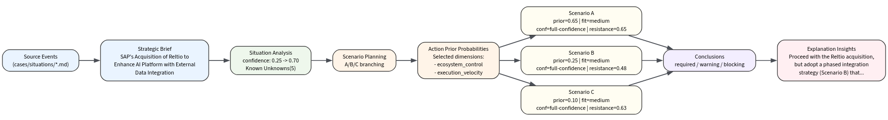
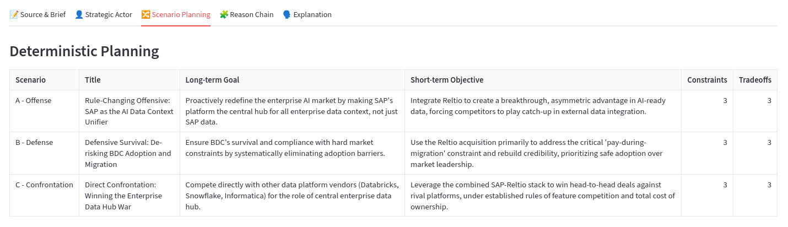

<div align="center">
<h1>OmenAI</h1>
<strong><p>开源战略推演引擎 － 分析、模拟、解释</p></strong>
<p><a href="README.md">English</a> | 中文</p>

    

</div>

[**Omen**](https://github.com/StrategyLogic/omen) （中文：爻）是一款基于**可解释AI**（XAI）技术的开源战略推演引擎。它将战略现象的本体建模与不确定性的反事实分析相结合，为决策者提供可验证、可追溯、可解释的战略洞察。

[核心概念](docs/concepts.md) | [快速开始](docs/quick-start.md) | [案例模板](docs/case-template.md) | [项目路线图](docs/roadmap.md)

## 🪄 核心能力

> 从分析、模拟，到解释。

Omen **不预测**单一未来，它是**为复杂性而生**的推演引擎。通过梳理复杂系统中的因果链条与逻辑依赖，Omen 生成可回放、可比较的分叉路径，揭示战略中的弱信号、控制点与演化规律，帮助决策者**清晰洞察**复杂局面：

*   🔄 **替代逻辑**：哪项技术会在什么临界条件下替代另一项？
*   🛡️ **能力演化**：哪些核心能力会先被增强，哪些将长期共存？
*   🏆 **策略胜率**：哪类策略组合更容易赢得市场、资本与开发者生态？
*   ⏳ **时间窗口**：何时是自研、结盟、并购或收缩的最佳时机？

通过可解释的推演路径，Omen 致力于揭示技术演进如何重塑市场格局，为战略决策**破解天机**。

## ✨ 主要功能

| 功能模块 | 描述 |
| :--- | :--- |
| **🧬 技术能力建模** | 将复杂的技术栈拆解为可量化、可比较的能力维度（如：延迟、吞吐量、易用性、生态丰富度）。 |
| **🤖 战略主体模拟** | 定义不同类型的市场参与者（初创公司、巨头、开源社区、监管机构），赋予其目标、资源与约束。 |
| **📈 市场演化推演** | 模拟采用率、市场份额、成本结构、现金流及生态系统的动态变化。 |
| **⚡ 临界点识别** | 自动发现“替代何时发生”、“为何在此刻发生”的关键阈值。 |
| **🔮 反事实分析** | 回答“如果当时没有发生 X 事件，或者采取了 Y 策略，结局会有什么不同？” |
| **📖 结果解释引擎** | 输出关键转折点、因果链条推导及策略含义，拒绝黑盒结论。 |

### 📊 典型输出

一次完整的推演通常会回答以下问题：
*   **是否替代？** 新技术是否会完全取代旧技术，还是形成互补？
*   **时间窗口？** 替代或转折发生的具体时间窗口是何时？
*   **关键驱动？** 哪些变量（如成本下降速度、API 兼容性）是决定性因素？
*   **赢家与输家？** 哪些主体率先受损，哪些主体意外获益？
*   **策略有效性？** 在何种情境下，“开放生态”优于“垂直整合”？
*   **终局形态？** 走向垄断、寡头平衡还是碎片化共存？

---

## 🫧 在线演示

如果你是：

- 战略顾问
- C级决策者
- 行业分析师
- 产品经理
- 其它非技术用户

希望快速体验 Omen 而勿须本地安装，请访问我们部署在 Streamlit Cloud 的演示应用。点击下面的链接，直接探索战略推演流程：

[👉 在线体验 Omen](https://omen-demo.streamlit.app)

---

## 🚀 快速上手

如果你是：

- 数据科学家
- AI 研究者
- 技术战略分析师
- 其它技术用户

希望在本地环境中运行 Omen，请继续阅读以下安装和运行指南。

### 🏗️ 安装

运行环境要求：Python 3.12+，并使用 `pip` 包管理器。

```bash
git clone https://github.com/StrategyLogic/omen.git
cd omen
pip install --upgrade pip setuptools wheel
pip install -e .
```

### 🌰 看例子

如果你希望快速查看 Omen 的运行效果，`demo` 目录中提供了可视化案例及其结果。运行：

```bash
streamlit run demo/app/scenario_planning.py
```

在浏览器中打开 `http://localhost:8501`，即可查看完整的战略推演流程。

### 🎵 跑流程

如果你希望亲自跑一遍完整的**分析——模拟——解释**流程，请使用我们准备的内置案例，用于模拟 2026 年 3 月 SAP 收购 Reltio 的情境。

案例文档位于 `cases/situations/sap_reltio_acquisition.md`，可以通过以下步骤端到端运行。

#### 第一步：分析

Omen 分析模块融合战略方法与数据工程管道，你仅需一行命令，即可从源文档中自动生成战略洞察与机器可消费的工件。

##### 情势分析
```bash
# 分析内置案例，并打包为 "sap" 别名
omen analyze situation --doc sap_reltio_acquisition --pack-id sap
```

此步骤会生成情势工件（Situation Artifact），并创建别名为 `sap` 的包，供后续步骤一致使用。

##### 情景规划

Omen 当前版本提供了确定性的 A/B/C 情景规划能力：

- 情景 A：进攻路线
- 情景 B：防御路线
- 情景 C：对抗路线

你可以使用 `sap` 别名直接定位上一步生成的情势工件：

```bash
omen scenario --situation sap
```

此步骤会在 `data/scenarios/sap/` 下生成用于模拟的情景包工件（Scenario Pack Artifact）。

#### 第二步：模拟

Omen 提供的模拟引擎可针对不同的情景进行推演。下面使用上一步生成的情景包工件，运行模拟：

```bash
omen simulate --scenario data/scenarios/sap/scenario_pack.json
```

此步骤将生成推演轨迹以及结果文件 `output/sap/result.json`。

#### 第三步：解释

Omen 解释模块会对模拟结果进行解读，并回溯情势工件中的关键决策点、风险项（已知的未知），生成面向决策者的洞察与建议：

```bash
omen explain --pack-id sap
```

该步骤生成结构化的解释工件 `output/sap/explanation.json`。

### 启动 UI 应用

Omen 还提供了一个基于 Streamlit 的 UI 应用，用于可视化完整的战略推演流程。

```bash
streamlit run app/scenario_planning.py
```
**战略推演全流程视图**



#### 更多细节

你可以点击页面上各个面板，查看从源文档到情势工件、情景工件、推演结果，再到解释工件的完整链路产出。



## 👥 适用人群

Omen 专为以下角色打造：
*   技术战略团队
*   产品与平台负责人
*   AI 基础设施研究者
*   开源生态观察者
*   投资与行业分析师

## 🎬 案例展示

### 战略主体分析

*  👤 [Elon Musk](cases/actors/elon-musk.md)
*  👤 [Jeff Bezos](cases/actors/jeff-bezos.md)
*  👤 [Steve Jobs](cases/actors/steve-jobs.md)
*  👤 [Jack Ma](cases/actors/jack-ma.md)
*  👤 [Chen Jiaxing (me)](cases/actors/chen-jiaxing.md)

### 战略推演案例

*   🧩 [SAP 收购 Reltio：主数据迷雾](cases/situations/sap_reltio_acquisition.md)
*   🗺️ [本体论博弈：数据库 vs AI 记忆](cases/ontology.md)
*   ⚔️ [向量数据库 vs AI 记忆](cases/vector-memory.md)

更多场景持续构建中（欢迎贡献）：
*   `智能体基础设施` vs `工作流平台`
*   `垂直领域 AI` vs `通用 AI 栈`
*   `开源模型` vs `闭源商业 API`
*   `数据治理` vs `AI 原生知识系统`

## 📃 许可证

Omen 采取[**AGPL-3.0-or-later**](LICENSE)许可证，由 **[StrategyLogic®](https://www.strategylogic.ai)** 开发与维护。

*注意：如果您希望在闭源环境中使用 Omen 或将其作为 SaaS 服务提供而不公开源码，请联系我们获取商业授权。*

## 🌟 愿景

Omen 希望成为一个**开放的战略推演工作台**：
> 它不输出唯一的答案，而是帮助人们系统地理解**未来如何分叉**；<br/>
> 理解**哪些条件塑造了结果**；<br/>
> 理解**哪些行动可以改变路径**。

如果你对技术演化、市场替代、战略建模或多智能体推演感兴趣，欢迎加入我们，共同解读这个混沌世界的*征兆*。

---
*模拟征兆，揭示混沌。*