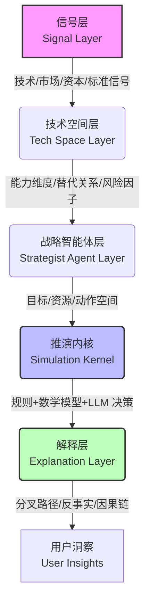

# Omen 爻

> 模拟征兆，揭示混沌。

**Omen（中文：爻）**是一个开源的**现象模拟器 (Phenomenon Simulator)**与战略推演引擎。它利用**多智能体博弈论**、**能力空间建模**与**反事实分析**，演算技术演化如何重构市场格局。

[English version](README.md) | [官方仓库](https://github.com/StrategyLogic/omen) | [核心概念](docs/concepts.md) | [快速开始](docs/quick-start.md) | [案例模板](docs/case-template.md) | [项目路线图](docs/roadmap.md)

## 💡 为什么需要 Omen？

技术竞争从未是线性的。真实世界的技术演化是由多种力量共同驱动的复杂系统：
*   **驱动力**：能力提升、成本曲线、迁移摩擦、组织惯性、资本流向、生态锁定、标准推进、开发者行为。
*   **影响力**：市场往往不会平滑变化，而是在某个阈值附近发生**加速替代**、**结构重组**，或陷入 **长期共存** 的僵局。

Omen 试图将这一过程从市场中的*观点争论*升级为决策者的**条件推演**：
1.  将技术竞争映射为**能力空间**
2.  将市场主体实例化为**战略智能体**
3.  将外部冲击量化为**可注入事件**
4.  将结果呈现为**多路径演化**与**反事实解释**

### Omen 具体做什么？

Omen 不承诺预测一个*确定的未来*，而是生成**可解释、可回放、可比较的未来分叉路径**。它的核心职责是揭示复杂系统中的微弱征兆、关键分叉点与演化轨迹，赋能创始人、产品战略家、技术领袖与投资分析师理解：

*   🔄 **替代逻辑**：哪项技术会在什么临界条件下替代另一项？
*   🛡️ **能力演化**：哪些核心能力会先被瓦解，哪些将长期共存？
*   🏆 **策略胜率**：哪类策略组合更容易赢得市场、资本与开发者生态？
*   ⏳ **时间窗口**：何时是自研、结盟、并购或收缩的最佳时机？

## 📜 哲学与设计原则

正如《周易》中的**爻**（yáo）代表变化与交互，Omen 仅负责呈现**情境** (象/Situation) 的演变。解读情境背后的深意并制定最终决策，是人类智慧的特权。

因此，Omen 被设计为一个**人类决策优先** 的AI模拟器，其架构清晰定义了双方的职责边界：

#### 🤖 机器（模拟与因果）
*   **职责**：计算复杂性，映射多路径演化，揭示条件化的因果链。
*   **输出**：可解释的场景、概率分布与“如果...会怎样”的分叉地图。
*   **约束**：严格避免确定性的命运判词或声称保证准确。

#### 🧠 人类（解释与主导）
*   **职责**：解释情境，应用判断，做出最终战略决策。
*   **特权**：基于价值观、风险偏好与愿景决定*选择哪条路径*，这是人类领导者的专属特权。
*   **协同**：Omen 拓展可见可能性的视野；人类提供导航的罗盘。

> 💡 **核心理念**：*机器模拟“情境”，人类决定“命运”。*

📜 详见[Omen 项目协议](PROTOCOL.md)

## ⚙️ 核心功能

| 功能模块 | 描述 |
| :--- | :--- |
| **🧬 技术能力建模** | 将复杂的技术栈拆解为可量化、可比较的能力维度（如：延迟、吞吐量、易用性、生态丰富度）。 |
| **🤖 战略主体模拟** | 定义不同类型的市场参与者（初创公司、巨头、开源社区、监管机构），赋予其目标、资源与约束。 |
| **📈 市场演化推演** | 模拟采用率、市场份额、成本结构、现金流及生态系统的动态变化。 |
| **⚡ 临界点识别** | 自动发现“替代何时发生”、“为何在此刻发生”的关键阈值。 |
| **🔮 反事实分析** | 回答“如果当时没有发生 X 事件，或者采取了 Y 策略，结局会有什么不同？” |
| **📖 结果解释引擎** | 输出关键转折点、因果链条推导及策略含义，拒绝黑盒结论。 |

### 📊 典型输出

一次完整的推演通常会回答以下问题：
*   **是否替代？** 新技术是否会完全取代旧技术，还是形成互补？
*   **时间窗口？** 替代或转折发生的具体时间窗口是何时？
*   **关键驱动？** 哪些变量（如成本下降速度、API 兼容性）是决定性因素？
*   **赢家与输家？** 哪些主体率先受损，哪些主体意外获益？
*   **策略有效性？** 在何种情境下，“开放生态”优于“垂直整合”？
*   **终局形态？** 走向垄断、寡头平衡还是碎片化共存？

## 🛠️ 工作原理

Omen 采用分层架构，确保推演的透明度与可干预性：



1.  **信号层**：接入多维度的宏观与微观信号。
2.  **技术空间层**：将信号转化为结构化的技术对象与关系图谱。
3.  **战略智能体层**：为各类主体定义明确的动作空间，而非自由聊天。
4.  **推演内核**：结合硬约束规则、经济/扩散模型与 LLM 决策逻辑，推进多轮演化。
5.  **解释层**：提取关键分叉点，生成人类可读的推演报告。

## 🎬 案例演示

我们已内置了经典推演：
*   [🗺️ 本体论博弈：数据库 vs AI 记忆](cases/ontology.md)

更多场景持续构建中（欢迎贡献）：
*   `智能体基础设施` vs `工作流平台`
*   `垂直领域 AI` vs `通用 AI 栈`
*   `开源模型` vs `闭源商业 API`
*   `数据治理` vs `AI 原生知识系统`

## 🚀 快速开始

### 开发环境
*   **语言**: Python 3.12+
*   **核心栈**: LangGraph, Python 引擎, LLM 适配器

### 安装
```bash
git clone https://github.com/StrategyLogic/omen.git
cd omen
python -m pip install --upgrade pip setuptools wheel
python -m pip install -e ".[dev]"
```

### 运行示例
```bash
# 运行模拟
omen simulate --scenario data/scenarios/ontology.json

# 使用固定 seed 运行（可复现）
omen simulate --scenario data/scenarios/ontology.json --seed 42

# 生成解释报告
omen explain --input output/result.json

# 使用通用覆盖参数做对比
omen compare --scenario data/scenarios/ontology.json --overrides '{"user_overlap_threshold": 0.9}'

# 使用商业主参数入口（资金冲击）做对比
omen compare --scenario data/scenarios/ontology.json --budget-actor ai-memory --budget-delta 200

# 保留历史输出（时间戳后缀）
omen compare --scenario data/scenarios/ontology.json --budget-actor ai-memory --budget-delta 200 --incremental
```

默认情况下，生成的本地文件会写入根目录下的 `output/` 目录（例如 `output/result.json`、`output/explanation.json`、`output/comparison.json`），以避免污染受跟踪的源文件。默认行为是按名称覆盖；添加 `--incremental` 到任何 CLI 命令将附加时间戳后缀并保留历史输出。
默认情况下，`simulate` 每次会使用随机 seed；当你需要稳定复现时，请显式传入 `--seed`。

## 👥 适用人群

Omen 专为以下角色打造：
*   技术战略团队
*   产品与平台负责人
*   AI 基础设施研究者
*   开源生态观察者
*   投资与行业分析师

## 📦 许可证

Omen（爻）项目采取[**AGPL-3.0-or-later**](LICENSE)许可证，由 **[StrategyLogic®](https://www.strategylogic.ai)** 开发与维护。

*注意：如果您希望在闭源环境中使用 Omen 或将其作为 SaaS 服务提供而不公开源码，请联系我们获取商业授权。*

## 🔮 愿景

Omen 希望成为一个**开放的战略推演工作台**：
> 它不输出唯一的答案，而是帮助人们系统地理解**未来如何分叉**；<br/>
> 理解**哪些条件塑造了结果**；<br/>
> 理解**哪些行动可以改变路径**。

如果你对技术演化、市场替代、战略建模或多智能体推演感兴趣，欢迎加入我们，共同解读这个混沌世界的*征兆*。

---
*模拟征兆，揭示混沌。*