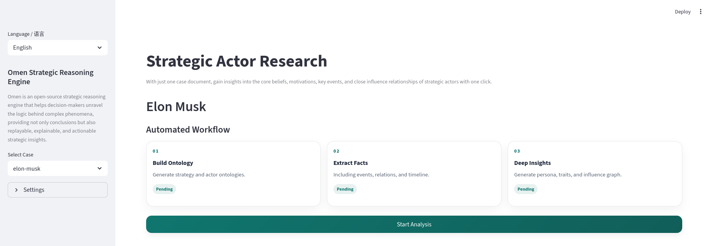
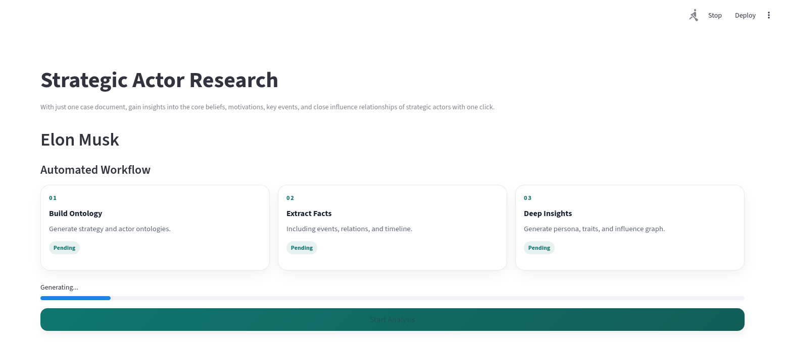

# 指南：构建战略主体

本指南说明如何从案例文档构建自定义的战略行动者产出物。

## 📁 工作目录

Omen 基于文件目录来管理和运行自动化工作流，目录结构如下：

```text
omen/
├─ cases/
│  └─ actors/                  # Strategic Actor 输入文档目录
│     ├─ elon-musk.md
│     └─ ...
├─ output/
│  └─ actors/                  # Strategic Actor 输出目录
│     └─ <actor_name>/
│        ├─ strategy_ontology.json
│        ├─ actor_ontology.json
│        ├─ analyze_status.json
│        ├─ analyze_persona.json
│        └─ generation.json
```

### 运行示例

选择一个根目录 `cases/actors/` 中预置的案例文档，如：`elon-musk.md`

运行分析命令，填写文档名称，不需要加 `.md` 扩展名：

```bash
omen analyze actor --doc elon-musk
```

结果将输出到 `output/actors/<actor_name>/` 目录下。

### 生成物清单

Omen 将在 `output/actors/<actor_name>/` 下生成以下文件：

| 名称 | 文件 | 说明 |
|------|------|------|
| 战略本体 | `strategy_ontology.json` | 战略上下文与结构化语义主文件 |
| 战略主体集 | `actor_ontology.json` | 包含参与者、行动者的本体数据（角色、事件、查询骨架等） |
| 战略状态快照 | `analyze_status.json` | 包含事件清单和关系描述 |
| 战略画像 | `analyze_persona.json` | 行动者画像分析结果（叙事、关键特质等） |
| 生成元数据 | `generation.json` | 本次生成过程与校验信息（是否复用、校验问题等） |

## 🔄 使用流程

如果你尚未安装 Omen，请先阅读 [快速指南](../quick-start.md)，完成环境配置和模型接入。

### 1. 准备输入文档

将案例文档放到 `cases/actors/`，例如：`cases/actors/chen-jiaxing.md`

#### 命名规范

- 文件名建议使用小写形式，例如：`chen-jiaxing.md`、`elon-musk.md`
- 文件名将作为命令中的 `--doc` 参数（不含 `.md` 扩展名）

例如：新增 `cases/actors/lily.md` 文档，执行分析的命令如下：

```bash
# 文件名 lily 作为 --doc 的参数
omen analyze actor --doc lily
```

#### 内容结构

Omen 未作强制模板要求，但建议包含以下内容：

```markdown
# 标题：人物名称

## 背景
- 身份/角色
- 关键经历
- 核心挑战

## 关键事件
### 事件1：时间 - 事件名称
事件描述，包括决策背景、行动、结果。

### 事件2：时间 - 事件名称
...

## 外部环境
- 市场/竞争环境
- 技术趋势
- 行业约束

## 结果与证据
- 阶段性成果
- 可引用的原始证据（文章、演讲、访谈等）
```

### 2. 构建 Strategic Actor

Omen 提供了 UI 和 CLI 两种方式构建 Strategic Actor，以支持用户直接使用、接入 AI Agent 以及自动化流程多种应用模式。

#### 2.1 使用 UI 构建

Omen 使用 Streamlit 交互式分析和展示。运行以下命令，启动应用：

```bash
streamlit run app/strategic_actor.py
```
随后在浏览器中打开 `http://localhost:8501`，左侧下拉菜单选择内置案例（来源于 `cases/actors/`），点击“开始分析”。



界面右上角将会出现一个动态的划桨提示，表示正在进行分析和生成，按钮上方也会出现进度条提示进展。



分析完成后，页面将展示战略画像叙事、关键特质、影响关系图和事件时间线。


#### 2.2 使用 CLI 构建

`omen analyze` 提供分析的主入口，运行以下命令分析战略网络中的参与者：

```bash
# 分析 cases/actors/chen-jiaxing.md
omen analyze actor --doc chen-jiaxing
```

构建完成后，检查 `output/actors/<actor_name>/` 是否包含以下文件：

| 文件 | 必须 | 说明 |
|------|------|------|
| `strategy_ontology.json` | ✅ | 战略本体 |
| `actor_ontology.json` | ✅ | 战略行动者本体 |
| `analyze_status.json` | ✅ | 战略状态快照 |
| `analyze_persona.json` | ✅ | 战略画像 |
| `generation.json` | ✅ | 生成元数据 |

## ✨ 高级命令使用

### 校验生成物

`omen validate` 命令提供产物结构校验功能：

```bash
omen validate actor --doc chen-jiaxing
```

校验输出示例：

```json
{
  "status": "pass",
  "target_artifact": "output/actors/chen-jiaxing/actor_ontology.json",
  "schema_version": "v0.1.0-actor",
  "errors": [],
  "warnings": []
}
```

如果校验失败，会显示具体错误和警告信息。

### 自定义参数

| 参数 | 说明 | 示例 |
|------|------|------|
| `--doc` | 案例文件名（不含扩展名） | `--doc chen-jiaxing` |
| `--output-dir` | 输出目录，默认 `output/actors` | `--output-dir ./my_output` |
| `--year` | 状态快照年份（用于历史时点分析） | `--year 2019` |
| `--date` | 状态快照精确日期 | `--date 2019-10-24` |
| `--force` | 强制重新生成，忽略缓存 | `--force` |

#### 参数使用示例

```bash
# 分析并指定输出目录
omen analyze actor --doc chen-jiaxing --output-dir ./my_analysis

# 分析2019年时间点的状态快照
omen analyze actor --doc chen-jiaxing --year 2019

# 强制重新生成
omen analyze actor --doc chen-jiaxing --force
```

---

## ❓ 常见问题

**Q：Omen Token 消耗严重吗？**

A：Omen 以“本地优先”为工具设计原则，充分利用本地缓存和本地计算资源。在分析工作流中，Omen 每一个步骤都优先使用本地缓存，如果没有才会调用大模型进行生成，帮助你节省 Token 消耗。

**Q：分析一份文档大概需要多少 Token？**

A：Token 消耗取决于文档长度和复杂度。以 10000 字左右的文档为例，经过 DeepSeek 测试，分析成本仅为 ￥1 分钱。

**Q：同一份文档变更时，如何更新本体生成？**

A：只需在命令中加上 `--force` 参数，Omen 会强制调用大模型，重新生成。

**Q：如何调整分析精度和生成质量？**

A：在 `config/llm.toml` 中调整模型参数（如 `temperature`、`top_p`），或更换更强的模型。

**Q：输出文件可以导入其他工具吗？**

A：所有输出均为标准 JSON 格式，可导入 Python、JavaScript 等环境进行二次处理。

**Q：如何贡献新的案例文档？**

A：在 `cases/actors/` 下添加新的 `.md` 文件，遵循文档结构建议，提交 PR。