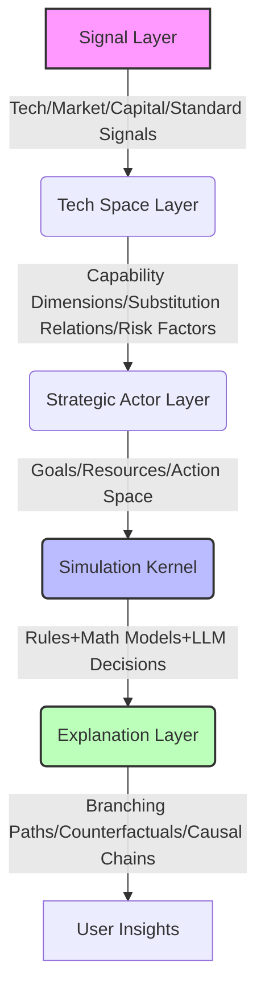

# 🛠️ How It Works

Omen adopts a layered architecture to ensure the transparency and intervenability of reasoning:

*   **Signal Layer**: Accesses multi-dimensional macro and micro signals.
*   **Tech Space Layer**: Transforms signals into structured technical objects and relationship graphs.
*   **Strategic Actor Layer**: Defines clear Action Spaces for various entities, rather than free-form chatting.
*   **Simulation Kernel**: Combines hard constraint rules, economic/diffusion models, and LLM decision logic to advance multi-round evolution.
*   **Explanation Layer**: Extracts key branching points and generates human-readable reasoning reports.