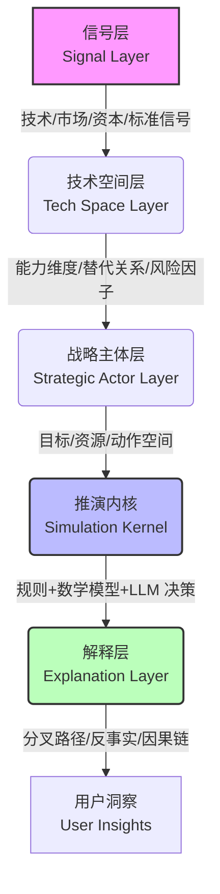

# 🛠️ 工作原理

Omen 采用分层架构，确保推演的透明度与可干预性：

1.  **信号层**：接入多维度的宏观与微观信号。
2.  **技术空间层**：将信号转化为结构化的技术对象与关系图谱。
3.  **战略主体层**：为各类主体定义明确的动作空间，而非自由聊天。
4.  **推演内核**：结合硬约束规则、经济/扩散模型与 LLM 决策逻辑，推进多轮演化。
5.  **解释层**：提取关键分叉点，生成人类可读的推演报告。