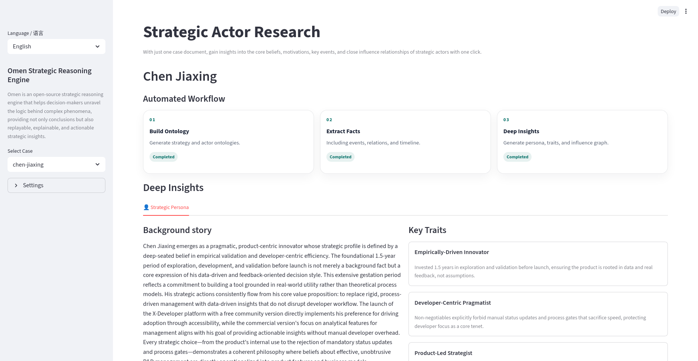
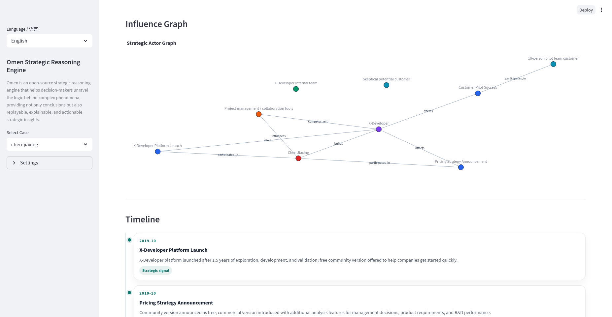

# 快速开始：使用 LLM 生成

Omen `0.2.0` 版本起集成大语言模型增强生成。本文档说明如何配置大模型，通过 `Strategic Actor` CLI 示例生成产出物、完成结果检查。

## 1. 准备运行

下载 Omen 源代码：

```bash
git clone git@github.com:StrategyLogic/omen.git
cd omen
```

在仓库根目录下执行以下命令，安装项目依赖：

```bash
python -m pip install --upgrade pip setuptools wheel
python -m pip install -e .
```

### 配置 LLM

首先准备环境变量文件：

```bash
cp .env.example .env
```

编辑 `.env` 文件，填入你的 API Key（如 `OPENAI_API_KEY` 或 `DEEPSEEK_API_KEY`）。

然后复制模型配置文件：

```bash
cp config/llm.example.toml config/llm.toml
```

编辑 `config/llm.toml`，确认 `provider`、`model` 以及引用的环境变量名是否正确。

## 2. 运行示例

示例文档在 `cases/actors/`，例如：`cases/actors/chen-jiaxing.md`

运行 CLI 命令，生成产出物：

```bash
omen analyze actor --doc chen-jiaxing
```

默认输出目录：`output/actors/chen-jiaxing/`

## 3. 检查生成结果

先检查目录与文件是否存在：

```bash
ls -lah output/actors/chen-jiaxing/
```

应包含以下文件：

- `strategy_ontology.json`
- `actor_ontology.json`
- `analyze_status.json`
- `analyze_persona.json`
- `generation.json`

执行结构校验：

```bash
omen validate actor --doc chen-jiaxing --output-dir output/actors
```

判定标准：

- 输出 `status=pass`：可进入后续 UI 展示或下游流程
- 输出 `status=fail`：根据 `errors` 字段逐项修复输入文档或配置后重试

## 4. 可视化展示

生成的 JSON 文件可通过 Omen UI 展示：

```bash
streamlit run app/strategic_actor.py
``` 

访问 `http://localhost:8501`，选择对应的输出目录，即可查看生成的战略本体、角色本体等信息。





---

## 常见问题

模型支持：当前版本仅支持 OpenAI Protocal 和 DeepSeek，确认 `config/llm.toml` 中 `provider` 字段正确设置。

找不到 `omen` 命令：确认虚拟环境已激活，或使用 `python -m pip install -e .` 重新安装。

LLM 调用失败：检查 `config/llm.toml` 与环境变量是否匹配。

`--doc` 报文件不存在：确认 `cases/actors/<doc>.md` 文件名与命令参数一致。
