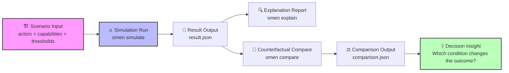

# 运行你的第一次战略推演

欢迎使用 **Omen**。本指南将带你快速运行首个战略推演案例：**本体论之战**。

这不仅仅是运行示例代码，而是体验一次完整的**战略推演工作流**：从设定战场条件，到观察演化终局，再到通过“反事实分析”追问“如果当时...会怎样”。

> 📖 **背景知识**：在开始之前，建议先阅读案例背景文档[本体论之战：数据库 vs AI记忆](../cases/ontology.md)，了解参战双方的能力设定与核心冲突。

## 🔄 推演工作流                      

在输入命令之前，让我们先理解 Omen 的核心工作流。



作为一个战略家，你将通过以下五个步骤与系统交互：

1.  **🏗️ 设定战场 (Scenario)**：定义市场初始条件、参与方能力与关键阈值。
2.  **⚔️ 执行模拟 (Simulation)**：让多智能体在博弈中演化，生成可能的未来路径。
3.  **🔍 生成解释 (Explanation)**：系统自动提取关键分叉点，解释“为什么”会发生这样的结局。
4.  **💭 提出假设 (Counterfactual)**：注入变量（如：“如果资金增加？”或“如果用户重叠度更高？”）。
5.  **⚖️ 对比洞察 (Comparison)**：对比基准与假设场景，识别改变结局的关键杠杆。

## 🚀 运行指南

**环境要求**：确保你的运行环境安装了 **Python**: 3.12+ 和 `pip` 包管理器。

### 🛠️ 配置 Omen 环境

下载 Omen 源代码后，在仓库根目录下执行以下命令，安装包含项目依赖：

```bash
python -m pip install --upgrade pip setuptools wheel
python -m pip install -e ".[dev]"
```

💡 **提示**：如果你仅需运行示例而不需要测试工具，可以使用精简安装：

```bash
python -m pip install -e .
```

## ⚔️ 运行推演工作流

我们将通过三个核心命令完成一次完整的推演循环。

### 第一步：执行模拟

运行基础场景，观察默认条件下的市场演化结果。

```bash
omen simulate --scenario data/scenarios/ontology.json
```

**输出文件**: `output/result.json`

**💡 高级用法**

**复现实验**：Omen 默认使用随机种子以模拟市场扰动。若需复现特定结果，请指定 `--seed`：

```bash
omen simulate --scenario data/scenarios/ontology.json --seed 42
```

**保留历史**：默认会覆盖旧结果。若需保留每次运行的记录，添加 `--incremental` 参数（会自动附加时间戳）：

```bash
omen simulate --scenario data/scenarios/ontology.json --incremental
```

### 第二步：生成解释

模拟结束后，让 Omen 为你解读结果背后的因果链条。

```bash
omen explain --input output/result.json
```

**输出文件**: `output/explanation.json`

> 此步骤将黑盒数据转化为可读的战略叙事，指出关键的转折点。

### 第三步：反事实对比

这是战略推演的核心。我们尝试改变一个条件，看看结局是否会发生逆转。

**场景 A：调整技术参数（提高用户重叠阈值）**

```bash
omen compare --scenario data/scenarios/ontology.json --overrides '{"user_overlap_threshold": 0.9}'
```

**场景 B：注入外部冲击（给 AI Memory 增加预算）**

```bash
omen compare --scenario data/scenarios/ontology.json --budget-actor ai-memory --budget-delta 200
```

**输出文件**: `output/comparison.json`

## 下一步

快速指南到这里结束。若你要继续：

- 术语与边界： [concepts.md](concepts.md)
- 战场输入结构： [ontology.md](ontology.md)
- 精度评估与门禁： [precision.md](precision.md)
- 数据摄取工作区： [ingest.md](ingest.md)

*Simulate the Signs. Reveal the Chaos.*