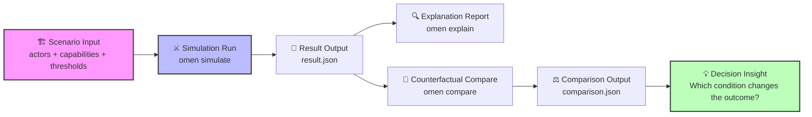

# 运行你的第一次战略推演

欢迎使用 **Omen**。本指南将带你快速运行首个战略推演案例：**本体论之战**。

这不仅仅是运行示例代码，而是体验一次完整的**战略推演工作流**：从设定战场条件，到观察演化终局，再到通过“反事实分析”追问“如果当时...会怎样”。

> 📖 **背景知识**：在开始之前，建议先阅读案例背景文档[本体论之战：数据库 vs AI记忆](../cases/ontology.md)，了解参战双方的能力设定与核心冲突。
## 🔄 推演工作流                      

在输入命令之前，让我们先理解 Omen 的核心工作流。



作为一个战略家，你将通过以下五个步骤与系统交互：

1.  **🏗️ 设定战场 (Scenario)**：定义市场初始条件、参与方能力与关键阈值。
2.  **⚔️ 执行推演 (Simulation)**：让多智能体在博弈中演化，生成可能的未来路径。
3.  **🔍 生成解释 (Explanation)**：系统自动提取关键分叉点，解释“为什么”会发生这样的结局。
4.  **💭 提出假设 (Counterfactual)**：注入变量（如：“如果资金增加？”或“如果用户重叠度更高？”）。
5.  **⚖️ 对比洞察 (Comparison)**：对比基准与假设场景，识别改变结局的关键杠杆。

## 🚀 运行指南

**环境要求**：确保你的运行环境安装了 **Python**: 3.12+ 和 `pip` 包管理器。

### 🛠️ 配置 Omen 开发环境

下载 Omen 源代码后，在仓库根目录下执行以下命令，安装包含项目依赖：

```bash
python -m pip install --upgrade pip setuptools wheel
python -m pip install -e ".[dev]"
```

💡 **提示**：如果你仅需运行示例而不需要开发测试工具，可以使用精简安装：

```bash
python -m pip install -e .
```

## ⚔️ 运行推演工作流

我们将通过三个核心命令完成一次完整的推演循环。

### 第一步：执行模拟

运行基础场景，观察默认条件下的市场演化结果。

```bash
omen simulate --scenario data/scenarios/ontology.json
```

**输出文件**: `output/result.json`

**💡 高级用法**

**复现实验**：Omen 默认使用随机种子以模拟市场扰动。若需复现特定结果，请指定 `--seed`：

```bash
omen simulate --scenario data/scenarios/ontology.json --seed 42
```

**保留历史**：默认会覆盖旧结果。若需保留每次运行的记录，添加 `--incremental` 参数（会自动附加时间戳）：

```bash
omen simulate --scenario data/scenarios/ontology.json --incremental
```

### 第二步：生成解释

推演结束后，让 Omen 为你解读结果背后的因果链条。

```bash
omen explain --input output/result.json
```

**输出文件**: `output/explanation.json`

> 此步骤将黑盒数据转化为可读的战略叙事，指出关键的转折点。

### 第三步：反事实对比

这是战略推演的核心。我们尝试改变一个条件，看看结局是否会发生逆转。

**场景 A：调整技术参数（提高用户重叠阈值）**

```bash
omen compare --scenario data/scenarios/ontology.json --overrides '{"user_overlap_threshold": 0.9}'
```

**场景 B：注入外部冲击（给 AI Memory 增加预算）**

```bash
omen compare --scenario data/scenarios/ontology.json --budget-actor ai-memory --budget-delta 200
```

**输出文件**: `output/comparison.json`

💡 **提示**：同样支持 `--incremental` 参数来保存多次对比实验的历史记录。

## 📊 推演结果解读

运行完成后，你将得到三个核心文件。以下是如何像战略分析师一样解读它们：

### 📄 终局形态
`result.json` 是推演的原始快照。关注以下关键字段：

| 字段 | 示例值 | 战略含义 |
| :--- | :--- | :--- |
| `outcome_class` | `"replacement"` | **终局判定**：市场是走向了“替代”、“共存”还是“僵局”？ |
| `winner.actor_id` | `"traditional-db"` | **胜出者**：在当前条件下，哪一方占据了生态位主导权？ |
| `winner.user_edge_count` | `609` | **生态规模**：胜出者的用户连接数，反映其护城河深度。 |
| `seed` | `40` | **实验指纹**：记录此次推演的随机种子，用于后续复盘。 |

### 📄 因果链条

`explanation.json` 是推演结果的解释报告，展示了关键的因果链条，确保没有黑盒结论，而是可追踪的逻辑路径：

*   **`branch_points` (关键分叉点)**: 系统识别出在 `step 1` 就触发了 `user_overlap` (用户重叠) 和 `competition_activation` (竞争激活)。
    *   *洞察*: 这表明该战场属于**“早期高重叠竞争”**，胜负往往在初期就已埋下伏笔。
*   **`causal_chain` (因果链)**: 描述了从“能力相似”导致“用户重叠”，进而触发“竞争边激活”，最终导致“用户迁移”的全过程。
*   **`narrative_summary` (叙事总结)**: 自动生成的一段自然语言总结，便于快速汇报。

### 📄 杠杆分析

`comparison.json` 是对比分析的结果文件，展示了在不同假设场景下的关键变化，这是决策价值最高的部分。它告诉你**什么改变了结局**。

**示例分析**:
*   **基准场景**: `outcome_class = replacement` (替代)
*   **假设场景** (阈值调至 0.9): `outcome_class = coexistence` (共存)
*   **差异 (`deltas`)**:
    *   `competition_edge_count`: `-3` (竞争边消失)
    *   `winner_user_edge_count`: `+32`

### 🧠 战略洞察

当我们将用户重叠阈值提高到 `0.9` 时，系统判定双方不再构成直接竞争（竞争边归零）。

**结论**: 市场形态从“你死我活的替代”切换为“和平共处”。这意味着，**提高产品差异化（降低用户感知重叠）是避免价格战、实现共存的关键杠杆。**

## 📂 工作流目录

工作流所有生成的产物默认位于仓库根目录的 `output/` 文件夹中：

```text
omen/
├── data/
├── output/
│   ├── result.json          # 推演结果
│   ├── explanation.json     # 解释报告
│   └── comparison.json      # 对比分析
├── ...
```

*   **覆盖策略**: 默认情况下，新运行会覆盖同名文件。
*   **版本管理**: 使用 `--incremental` 参数可生成带时间戳的文件（如 `result_20231027_1030.json`），方便进行多轮实验对比。
*   **Git 忽略**: `output/` 目录已预置在 `.gitignore` 中，请放心运行，无需担心提交本地数据。

---

**下一步？**

尝试修改 `data/scenarios/ontology.json` 中的参数，或者阅读 [核心概念文档](docs/concepts.md) 学习如何构建你自己的战略场景。

*Simulate the Signs. Reveal the Chaos.*