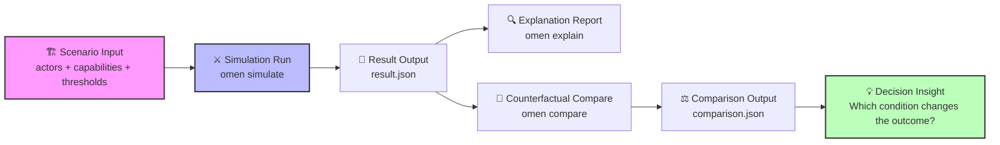

# 💡 为什么需要 Omen？

> 战略选择并非线性，而是不断适应一个不断演化的生态系统。

技术竞争从来都不是线性规划。真实世界的技术演化是由多种力量共同驱动的复杂系统：
*   **驱动力**：能力提升、成本曲线、迁移摩擦、组织惯性、资本流向、生态锁定、标准推进、开发者行为。
*   **影响力**：市场往往不会平滑变化，而是在某个阈值附近发生**加速替代**、**结构重组**，或陷入 **长期共存** 的僵局。

Omen 试图将这一过程从市场中的*观点争论*升级为决策者的**条件推演**：
1.  将技术竞争映射为**能力空间**
2.  将市场主体实例化为**战略主体**
3.  将外部冲击量化为**可注入事件**
4.  将结果呈现为**多路径演化**与**反事实解释**

基于这一框架，Omen 设计了一个战略推演流程，帮助用户进行**可解释、可回放、可比较的未来分叉路径生成**，并通过**因果链条推导**揭示关键分叉点背后的驱动因素和策略含义。

## 🔄 推演工作流

作为一个战略家，你将通过以下五个步骤与系统交互：

1.  **🏗️ 设定战场 (Scenario)**：定义市场初始条件、参与方能力与关键阈值。
2.  **⚔️ 执行模拟 (Simulation)**：让多智能体在博弈中演化，生成可能的未来路径。
3.  **🔍 生成解释 (Explanation)**：系统自动提取关键分叉点，解释“为什么”会发生这样的结局。
4.  **💭 提出假设 (Counterfactual)**：注入变量（如：“如果资金增加？”或“如果用户重叠度更高？”）。
5.  **⚖️ 对比洞察 (Comparison)**：对比基准与假设场景，识别改变结局的关键杠杆。

继续阅读[战略推演指南](guides/run-strategic-reasoning-flow.md)，你将理解如何使用 Omen 来模拟技术竞争中的复杂动态，识别关键的战略机会和风险，并为你的决策提供数据驱动的洞察。