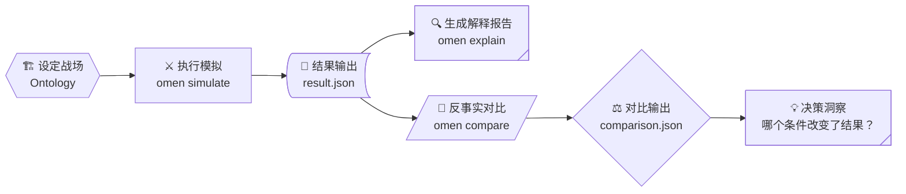

> **模拟征兆，揭示混沌。**<br/>
> *Simulate the Signs. Reveal the Chaos.*

在战略咨询的深水区，我们正共同面对一个棘手的困境：当技术范式剧烈变迁（比如 GenAI 重构软件栈），传统的线性外推和专家直觉，正在快速失效。

市场不是一条平滑的曲线，它充满了**临界点**、**相变**和**非线性分叉**。当客户问出那些决定企业生死的问题时——

- “如果我们现在All in，真能扭转被替代的命运吗？”
- “在什么条件下，新旧技术才能长期共存，而非你死我活？”

我们需要的，不是一个静态的PPT结论，而是一个**可交互、可运行、可复现的战略推演实验室**。

## 💡 Omen：爻来了

今天，我们正式启动开源项目 **Omen（中文：爻）** 并实现核心工作流。它不是一个预测未来的水晶球，而是一个**现象模拟器**（Phenomenon Simulator）。它基于多智能体博弈与反事实分析，帮助战略顾问构建、运行并解读**战略推演工作流**（The Reasoning Workflow），将模糊的直觉，转化为可验证的逻辑。

**项目地址**：[https://github.com/StrategyLogic/omen](https://github.com/StrategyLogic/omen)

## 🔄 战略推演工作流

这条工作流的职责是将混沌局势，转化为结构化实验。



在 Omen 的哲学中，机器负责计算复杂性，人类负责定义命运。我们将传统的战略分析过程重构为五个标准化的步骤，形成闭环：

1.  **🏗️ 设定战场 (Scenario)**：将模糊的市场直觉，转化为清晰的“能力空间”、“参与方约束”与“关键阈值”。
2.  **⚔️ 执行模拟 (Simulation)**：让多智能体在预设规则中博弈演化，生成多种可能的未来路径（而非单一终局）。
3.  **🔍 生成解释 (Explanation)**：系统自动追溯关键分叉点，精准回答“为什么会走到这一步”。
4.  **💭 提出假设 (Counterfactual)**：调整关键变量——“如果预算翻倍？”、“如果迁移成本为零？”
5.  **⚖️ 对比洞察 (Comparison)**：量化不同路径的差异，识别那个能真正改变终局的**关键战略杠杆**。

这不仅是代码的运行，更是**战略思维的具象化工程**。

## 💻 演示：从代码到洞察

得再多，不如上手一试。让我们通过一个真实的 MVP 案例：本体论之战，来看看这个工作流是如何落地的。

> 📖 **背景知识**：在开始之前，建议先阅读案例背景文档[本体论之战：数据库 vs AI记忆](https://github.com/StrategyLogic/omen/cases/ontology.md)，了解参战双方的能力设定与核心冲突。

### 1. 结构化输入：定义战场

推演的起点不是闲聊，而是用结构化数据定义战场。在 `data/scenarios/ontology.json` 中，我们定义了双方的能力维度与竞争阈值：

```json
{
  "scenario_id": "ontology_battlefield_v1",
  "actors": [
    {
      "id": "traditional-db",
      "capabilities": {"latency": 0.9, "ecosystem": 0.95, "cost": 0.6},
      "strategy": "defend_moat"
    },
    {
      "id": "ai-memory",
      "capabilities": {"latency": 0.7, "ecosystem": 0.4, "cost": 0.8},
      "strategy": "disruptive_growth"
    }
  ],
  "thresholds": {
    "user_overlap_threshold": 0.75, 
    "migration_friction": 0.5
  }
}
```
*这是战略顾问的“沙盘”：每一个参数都对应着一个具体的业务假设。*

### 2. 模拟与解释：看见因果链

运行推演后，Omen 不仅告诉你谁赢了，更给出了**赢的逻辑**。

```bash
# 执行模拟
omen simulate --scenario data/scenarios/ontology.json --output result.json

# 生成解释报告
omen explain --input result.json
```

生成的 `explanation.json` 拒绝黑盒，揭示了深层的逻辑链条：

```json
{
  "outcome_class": "replacement",
  "winner": "traditional-db",
  "branch_points": [
    {
      "step": 1,
      "event": "competition_activation",
      "condition": "user_overlap > 0.75",
      "impact": "High intensity price war triggered immediately."
    }
  ],
  "causal_chain": "High capability similarity -> User overlap exceeds threshold -> Competition edges activate -> AI Memory fails to gain traction due to migration friction.",
  "narrative_summary": "在当前参数下，由于用户重叠度极高且迁移摩擦大，市场在首轮即进入存量博弈，传统数据库凭借生态护城河实现了‘替代’结局。"
}
```
**注意 `causal_chain` 字段**：它清晰地指出，AI Memory 的失败并非“技不如人”，而是“迁移摩擦”在“高同质化”条件下被指数级放大了。这才是真正 actionable 的洞察。

### 3. 反事实分析：寻找战略杠杆

这是整个推演中最具价值的一步。如果我们改变策略，结局能反转吗？我们假设产品做到足够差异化，将用户重叠阈值从 0.75 提高到 0.9：

```bash
omen compare --scenario data/scenarios/ontology.json \
  --overrides '{"user_overlap_threshold": 0.9}' \
  --output comparison.json
```

对比结果 `comparison.json` 直接给出了战略答案：

```json
{
  "baseline_outcome": "replacement",
  "variation_outcome": "coexistence",
  "deltas": {
    "competition_edge_count": -3, 
    "market_stability_index": "+0.45"
  },
  "strategic_insight": "Raising the differentiation threshold to 0.9 deactivates direct competition edges. The market shifts from 'zero-sum replacement' to 'niche coexistence'."
}
```
**结论**：只需将产品差异化程度提升（重叠阈值从 0.75 升至 0.9），市场的终局就从“你死我活”的存量厮杀，变成了“相安无事”的细分共存。**这就是推演带来的决策价值：找到那个最小的改变，撬动最大的战略红利**。

### 4. 可复现资产：让战略洞察不再是一次性的

Omen 的所有产出都是结构化、可版本管理的文件，让团队协同与复盘变得前所未有的简单：

```text
project_root/
├── data/
│   └── scenarios/
│       ├── ontology_base.json       # 基准场景
│       └── ontology_high_diff.json  # 差异化场景
├── output/
│   ├── result_base.json             # 基准推演结果
│   ├── explanation_base.json        # 基准因果解释
│   └── comparison_diff.json         # 差异分析报告
└── logs/
    └── simulation_trace.log         # 完整演化日志
```
*在这里，每一次推演都是一次可回溯、可复现的战略实验，而非一次性的头脑风暴。*

## 🔮 未来愿景：从推演工具到战略副驾

目前的 MVP 版本已构建起完整的**推演骨架**：结构化输入、多智能体博弈内核、因果解释引擎及反事实对比工具。它证明了“战略推演”可以像软件工程一样被标准化、被运行、被验证。

### 下一步是什么？

我们正在将 LLM 深度整合进工作流：

*   **无代码交互**：未来，你可以用自然语言描述战略假设（“如果谷歌下周发布一款免费的竞品...”），LLM 将自动将其翻译为精确的结构化场景参数。
*   **智能解读**：LLM 将分析复杂的推演日志，为你生成更具洞察力的战略报告，甚至主动提出你未曾想到的反事实假设。
*   **动态迭代**：推演将不再是单次运行，而是一场由 LLM 驱动的连续对话式探索，直到穷尽所有可能性，找到最优解。

技术上，这没有不可逾越的障碍；但在战略上，这标志着**人类智慧与机器算力的完美协同**。

## 🚀 加入推演者行列，在混沌中看见未来

> **Omen 核心理念**：*机器模拟局势，人类决定命运。*

Omen 现已在 GitHub 开源。我们邀请各位战略顾问、技术领袖和行业分析师，成为第一批“推演者”。

*   **项目地址**：[https://github.com/StrategyLogic/omen](https://github.com/StrategyLogic/omen)
*   **快速开始**：查看我们的[快速指南](docs/quick-start.md)，在本地运行你的第一个战略推演实验。

在这个VUCA时代，让我们不再依赖直觉去猜测未来，而是用推演去**看见未来**的每一个分叉，从而做出那个更明智、更笃定的选择。

**Simulate the Signs. Reveal the Chaos.**